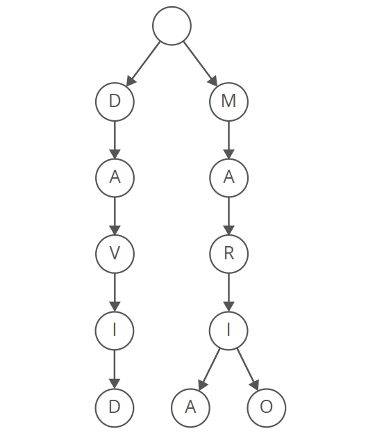

[](https://github.com/Bryannsss140101/SugestionTrie/blob/main/LICENSE)

# 🔠 Suggestion Trie

Un proyecto en `C++` que implementa un `Árbol Trie` combinado con un algoritmo de búsqueda en profundidad `(DFS)` para ofrecer sugerencias rápidas y eficientes basadas en prefijos. Es ideal para aplicaciones de autocompletado y búsqueda predictiva, mejorando el rendimiento en búsquedas interactivas.

### 📜 Tabla de contenido
1. [Descripción](#descripción)
2. [Funciones](#funciones)
3. [Implementación](https://github.com/Bryannsss140101/SugestionTrie/blob/main/README.md#%EF%B8%8F-implementaci%C3%B3n)
4. [Contribuciones](https://github.com/Bryannsss140101/SugestionTrie/edit/main/README.md#-contribuciones)

## Descripción

El **Árbol Trie** es una herramienta eficiente para manejar palabras y encontrar patrones comunes entre ellas, esta estructura se combina con un recorrido especial llamado **Búsqueda en profundidad (DFS)** para encontrar palabras que comiencen con un mismo prefijo.

El sistema permite sugerir palabras de forma rápida y sencilla, siendo ideal para funciones como autocompletado o búsqueda rápida en listas grandes de texto. Es una solución práctica para optimizar tareas que trabajan con muchas palabras.



## Funciones

- **insert**: Inserta un nuevo nodo en el árbol.
  ```cpp
  Node *Trie::insert(const std::string &word, Node *node) {
    const auto index = to_index(std::tolower(word[0]));

    if (node == nullptr)
        node = new Node();

    if (word.empty()) {
        node->word_end = true;
        return node;
    }

    node->children[index] = insert(word.substr(1), node->children[index]);
    return node;
  }
- **search**: Buscar un nodo en el árbol.
  ```cpp
    bool Trie::search(const std::string &word, Node *node) {
    const auto index = to_index(std::tolower(word[0]));

    if (node == nullptr)
        return false;

    if (word.empty())
        return node->word_end;

    return search(word.substr(1), node->children[index]);
  }
- **find**: Buscar y retorna un nodo en el árbol.
  ```cpp
    Node *Trie::find(const std::string &word, Node *node) {
    if (node == nullptr || word.empty())
        return node;

    const auto index = to_index(std::tolower(word[0]));
    return find(word.substr(1), node->children[index]);
  }
- **DFS**: Busqueda en profundidad apartir de un nodo.
  ```cpp
    void Trie::DFS(const std::string &prefix, Node *node, std::vector<std::string> &words) {
    if (node == nullptr)
        return;

    if (node->word_end)
        words.push_back(prefix);

    for (int i = 0; i < 27; ++i)
        if (node->children[i] != nullptr) {
            const char c = i == 26 ? ' ' : 'a' + i;
            DFS(prefix + c, node->children[i], words);
        }
    }
  
### 🖥️ Implementación
Para ejecutar este proyecto en tu máquina local, clona el repositorio y ejecuta el archivo `main.cpp`.
```bash
git clone https://github.com/Bryannsss140101/SugestionTrie.git
cd SugestionTrie
```

### 🤝 Contribuciones
¡Las contribuciones son bienvenidas! Si encuentras algún error o tienes sugerencias de mejora, no dudes en abrir un issue o hacer un pull request. Sigue estos pasos para contribuir:

1. **Haz un fork**: Haz clic en "Fork" en GitHub para crear tu propia copia del proyecto.
2. **Crea una nueva rama**:
   ```bash
   git checkout -b new-branch.
   ```
4. **Realiza los cambios necesarios**: Edita los archivos que necesites.
5. **Haz commit de tus cambios**:
   ```bash
   git add .
   git commit -m "My awesome commit"
   ```
7. **Sube tus cambios**:
   ```bash
   git push origin new-branch
   ```
9. **Crea un pull**: Dirigete a GitHub y crea un `pull request` para agregar tus cambios.

